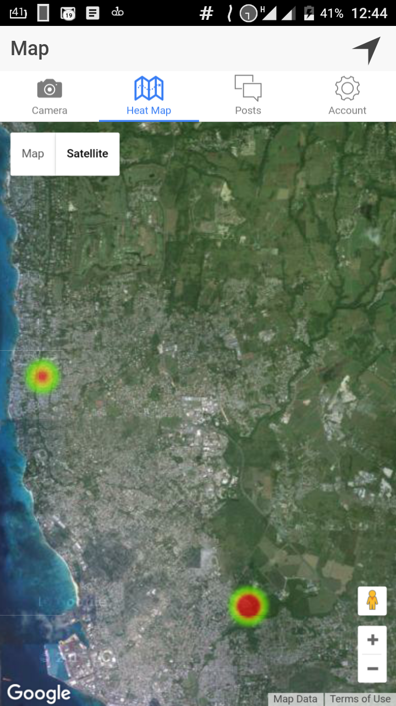
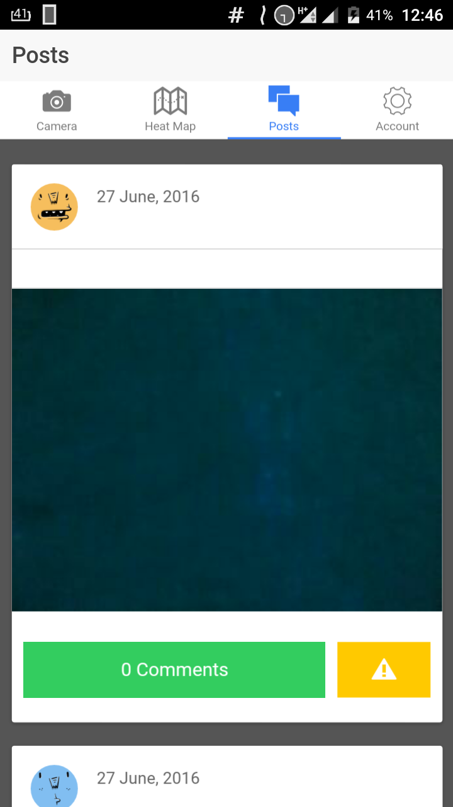
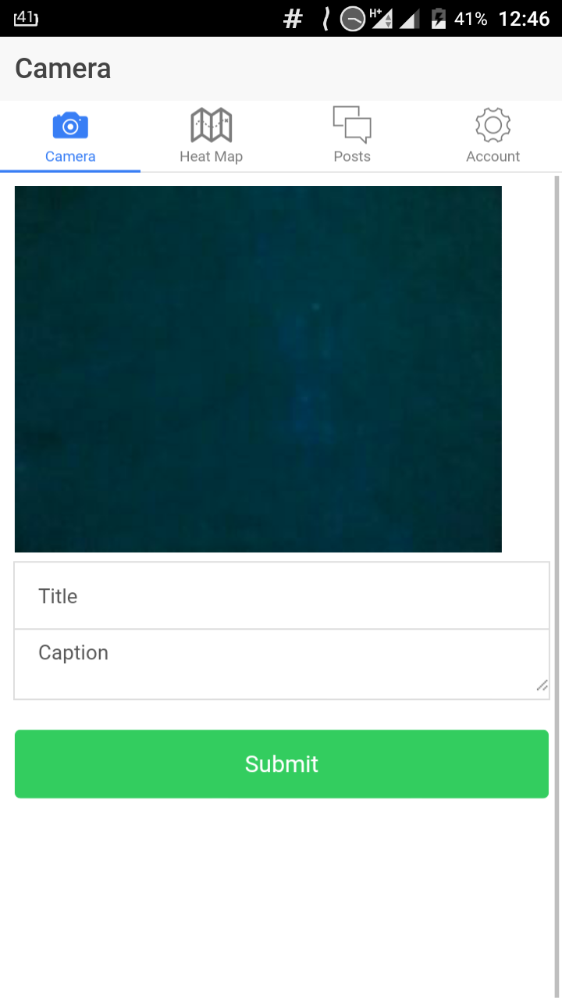
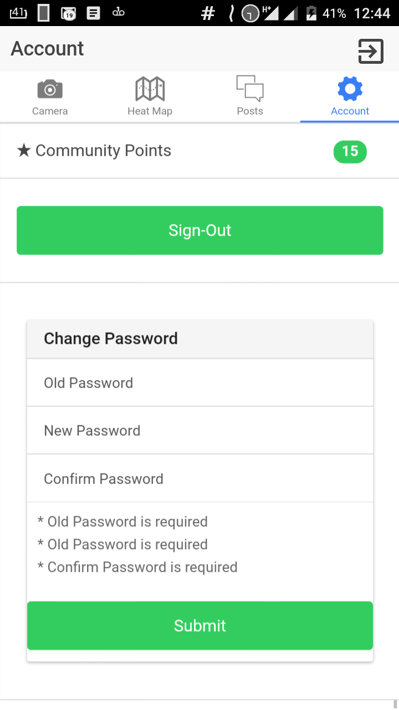

#Viron

__Welcome to Viron!__

Viron is an environmental app which aims to locate indiscriminate disposal of waste by giving the user the power to have an impact on their environment and giving them an easy outlet of getting involved.

#THE TEAM

__Team Leader & Developer__                       :-Rashawn Clarke
                                                  Email:- rashawn.clarke@gmail.com

__Developer & User Experience Design__            :-Micheal Drayton
                                                  Email:- draytxn1@gmail.com

__Research & Front-End Devolpment__               :-Kevin Yarde
                                                  Email:- kevin.yarde@hotmail.com

__Research & User Experience Design__             :-Shanice Waterman
                                                  Email:- akela.scaw@gmail.com

#How to run Viron on your mobile device
1. Install Ionic View:

2. Navigate to Preview App and enter the code: *7E2397B1*

3. Load and launch the App

#Screenshots

